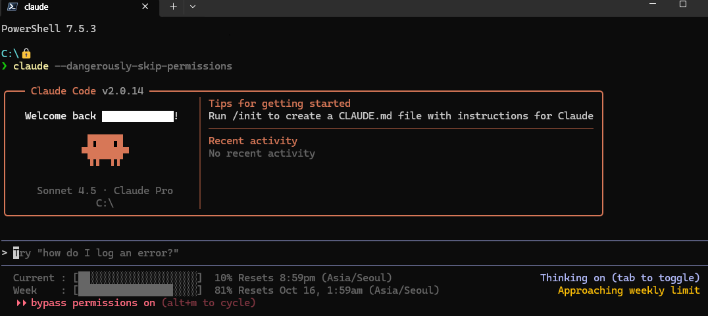
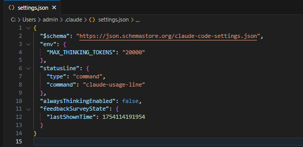
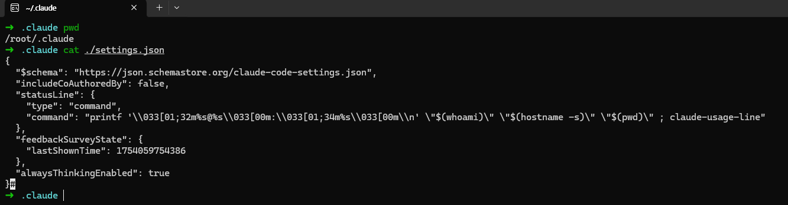

# claude-usage-line

> [English](README.md) | [한국어](README-ko.md)

A lightweight daemon that displays Claude CLI usage statistics directly in your terminal status line.



## 📋 Requirements

- [Claude Code](https://claude.com/code)
- Rust toolchain (install via [rustup](https://rustup.rs/))

## 🚀 Quick Start

### 1. Install

```bash
cargo install --git https://github.com/somersby10ml/claude-usage-line
```

### 2. Command Line Options

`claude-usage-line` supports the following options:

| Option | Description | Default | Example | Unit |
|--------|-------------|---------|---------|------|
| `--debug` | Enable debug logging | `false` | `claude-usage-line --debug` | - |
| `--refresh-interval` | Usage refresh interval | `4` | `claude-usage-line --refresh-interval 5` | minutes |
| `--idle-timeout` | Daemon idle timeout before shutdown | `10` | `claude-usage-line --idle-timeout 15` | minutes |
| `--ccjs` | Custom path to Claude Code cli.js | (auto-detected) | `claude-usage-line --ccjs /path/to/cli.js` | - |

**Note**: When using in `statusLine.command`, you typically don't need to specify any options. The daemon will be spawned automatically with default settings.

### 3. Configure Claude Code

#### Windows

Add to `%USERPROFILE%\.claude\settings.json`:

```json
{
  "statusLine": {
    "command": "claude-usage-line"
  }
}
```



#### Linux/macOS

Add to `~/.claude/settings.json`:

```json
{
  "statusLine": {
    "command": "printf '\\033[01;32m%s@%s\\033[00m:\\033[01;34m%s\\033[00m\\n' \"$(whoami)\" \"$(hostname -s)\" \"$(pwd)\" ; claude-usage-line"
  }
}
```

Feel free to customize the command to your preference.



### 4. Initialize Cache

Run `claude-usage-line` manually once or twice. It's normal to see blank output on the first 1-2 runs.

```bash
claude-usage-line
```

### 5. Trust Cache Directory

Navigate to the cache directory and run `claude`:

- **Windows**: `%LOCALAPPDATA%\claude-usage-line`
- **Linux/macOS**: `~/.cache/claude-usage-line`

When prompted "Do you trust the files in this folder?", click **Allow** and close.

## 🔧 Troubleshooting

### Cache Not Updating

If usage statistics don't appear or update after initial installation:

1. Kill all running `claude-usage-line` processes:
   ```bash
   # Windows
   taskkill /F /IM claude-usage-line.exe

   # Linux/macOS
   pkill claude-usage-line
   ```
2. Ask Claude again to refresh the status line

The daemon caches data every 4 minutes by default. If changes don't appear immediately, restarting the process will force a fresh cache.

## 🗑️ Uninstall

1. Remove `claude-usage-line` from `.claude/settings.json`
2. Kill all running processes:
   ```bash
   # Windows
   taskkill /F /IM claude-usage-line.exe

   # Linux/macOS
   pkill claude-usage-line
   ```
3. Uninstall via cargo:
   ```bash
   cargo uninstall claude-usage-line
   ```

## 💬 Issues

Found a bug or have a suggestion? Feel free to [open an issue](../../issues)!
